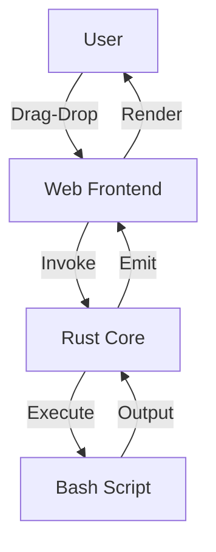

# SEO Image Processor UI Architecture

## 1. Requirements Analysis

- **Core Functionality**: GUI wrapper for seo_image_processor.sh script
- **Key Features**:
  - Drag-and-drop support for selecting image directory
  - Progress monitoring and logs display
  - Configuration options (e.g., Ollama model, quality settings)
  - Start/Stop processing button
  - Error handling and notifications
- **Non-Functional Requirements**:
  - Cross-platform (Linux primary, but Windows/Mac compatible)
  - Simple setup: Single executable, no manual dependencies
  - Stylish UI: Modern, responsive, intuitive
  - Performance: Handle large directories without freezing
  - Security: Sanitize inputs, no arbitrary code execution
- **Constraints**:
  - Integrate existing bash script
  - Minimal dependencies
  - Easy to run: Double-click executable

## 2. System Decomposition

- **Components**:
  - **UI Layer**: Web frontend (HTML/CSS/JS) rendered in webview
  - **Backend Layer**: Rust core handling file system and script execution
  - **Processing Engine**: Existing seo_image_processor.sh script
  - **State Management**: Simple store (e.g., Svelte/Vue) for app state
- **Services**:
  - Directory Selector Service: Handles drag-drop and folder selection via JS APIs
  - Script Executor Service: Runs bash script via Tauri's process commands
  - Log Monitor Service: Real-time log streaming to UI via event listeners
  - Notification Service: System tray integration via Tauri APIs

## 3. Interface Design

- **UI Layout**:
  - Top: Header with app title and settings button
  - Center: Large drag-drop zone (70% height) with instructions
  - Right Sidebar: Configuration panel (toggleable)
  - Bottom: Progress bar, start button, log viewer
- **Data Contracts**:
  - Invoke commands: e.g., invoke('run_script', { path: string })
  - Script params: Array of args to bash script
- **Communication**:
  - Tauri invoke/listen for frontend-backend comms
  - Process API for script execution with stdout/stderr events

## 4. Visualization

### High-Level System Diagram



### Detailed UI Wireframe

```mermaid
graph TD
    subgraph "Main Window [100vw x 100vh]"
        Header[Header: App Title, Settings Icon<br>bg-blue-500 text-white p-4]
        subgraph "Content Area [flex row]"
            DropZone[Drop Zone: 70% width<br>Dashed border, icon + text<br>bg-gray-100 hover:bg-gray-200]
            Sidebar[Sidebar: 30% width<br>Config forms: model select, quality slider<br>bg-white shadow-lg p-4<br>Toggleable]
        end
        Footer[Footer: Process Button (green bg), Progress Bar<br>Log Viewer (collapsible textarea)<br>bg-gray-50 p-4]
    end
    Header --> Content Area
    Content Area --> Footer
    style Header fill:#3b82f6,stroke:#000
    style DropZone fill:#f3f4f6,stroke:#d1d5db,stroke-dasharray:5 5
    style Sidebar fill:#ffffff,stroke:#e5e7eb
    style Footer fill:#f9fafb,stroke:#000
    style Content Area fill:none,stroke:none
```

#### Layout Rationale
- **Header**: Fixed top for branding and quick settings access
- **Drop Zone**: Central, prominent for main interaction; uses HTML5 drag-drop API
- **Sidebar**: Right-aligned, collapsible to maximize space; Tailwind for responsive styling
- **Footer**: Bottom for controls and feedback; real-time updates via Tauri events
- **Styling**: Tailwind CSS for modern, customizable look; themes: blue accents, clean whites/grays
- **Responsiveness**: Flexbox layout, min-width 800px, mobile-friendly scaling

## 5. Validation & Expert Review

- **Meets Requirements**: Yes, Tauri enables easy "click and go" via small executables; UI is intuitive with central drop zone.
- **Quality Attributes**: Lightweight and secure via Rust, but add ARIA for accessibility; user-friendly but needs dark mode toggle.
- **Potential Issues**:
  - Dependencies: Add runtime checks and user prompts to install cwebp/ollama if missing.
  - Security: Validate script inputs; use Tauri's allowlist for commands to prevent injection.
  - Performance: Implement throttling for log updates during heavy processing.
  - State Management: Specify Svelte stores for reactive updates without Redux overhead.
- **Rationale**: Tauri is excellent choice over Electron for efficiency; however, document fallback for script errors and add UI for config persistence (e.g., localStorage).
- **Recommendations**: Strengthen with dependency installer integration, more granular error handling in UI, and unit tests for interfaces.
